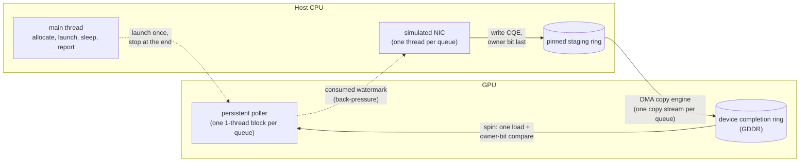
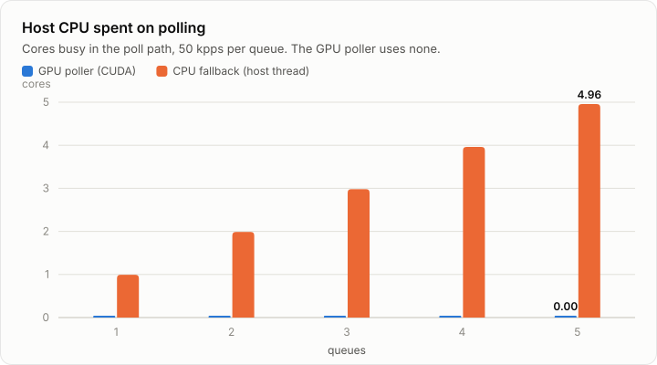
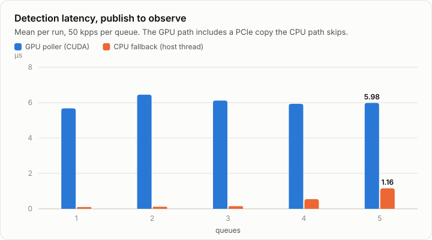
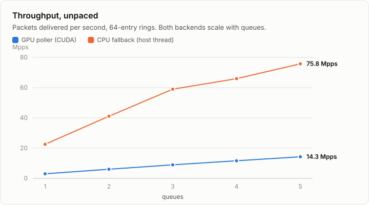
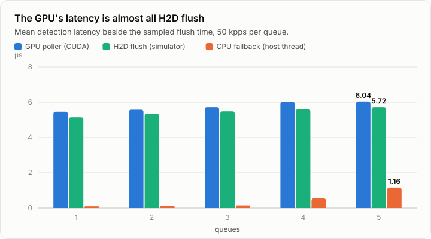
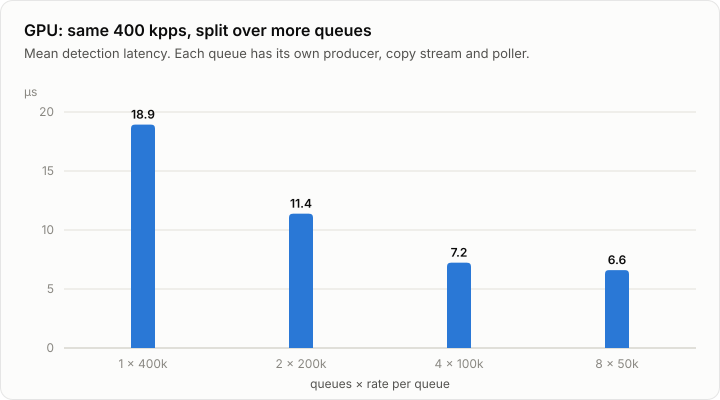

# GPU-NIC-Poll

Moving steady-state receive-side completion-queue polling off the CPU and onto
GPU SMs.

A `CompletionRing` lives in GPU memory. A persistent CUDA kernel polls it from an
SM and counts arrivals. The host allocates, launches, sleeps, and reports — it
does no per-packet work at all.

With `--queues N` there are N independent rings, each polled by its own
single-thread block of one `<<<N, 1>>>` launch — the GPU-side equivalent of a
multi-queue NIC. Queues share nothing, so throughput scales with `N` while
per-queue latency stays flat.

Real NIC hardware is not wired up yet, so a host thread stands in for it. See
[`docs/design.md`](docs/design.md) for the protocol and the reasoning.



Each queue gets its own copy of everything except the main thread. With a real
NIC, the NIC DMAs straight into the device ring, so the simulated producer, the
staging ring and the copy step all go away. The poller stays the same.

## GPU polling vs CPU polling

Both backends run the **same poll loop over the same owner-bit ring**. They
differ only in where the loop runs and which memory it reads:

| | GPU poller ([`poll_kernel.cu`](src/gpu/poll_kernel.cu)) | CPU fallback ([`poll_cpu.cpp`](src/gpu/poll_cpu.cpp)) |
|---|---|---|
| poll loop runs on | an SM: one single-thread block per queue | a host core: one spinning thread per queue |
| ring it reads | device memory, filled by DMA over PCIe | host memory, written directly by the producer |
| **host cores spent polling** (5 queues) | **0.00** | **4.96** |
| mean detection latency (5 queues × 50 kpps) | 6.0 µs | 1.16 µs |
| … of which H2D flush (simulator only) | 5.7 µs | none |
| poll loop period (1 queue) | 1.3 µs | 0.002 µs |
| unpaced throughput (5 queues) | 14.3 Mpps | 75.8 Mpps |

<picture>
  <source media="(prefers-color-scheme: dark)" srcset="docs/img/host-cpu-dark.svg">
  
</picture>

<picture>
  <source media="(prefers-color-scheme: dark)" srcset="docs/img/latency-dark.svg">
  
</picture>

<picture>
  <source media="(prefers-color-scheme: dark)" srcset="docs/img/throughput-dark.svg">
  
</picture>

**How to read these charts:**

- **Host CPU is the result that matters, and the simulator doesn't affect it.**
  A spinning poll thread burns a full core whether packets arrive or not; the
  CPU fallback costs exactly one core per queue. The GPU poller costs **no host
  CPU at all**. Its price is an SM block slot per queue instead (see
  [Multi-queue](#multi-queue)).
- **Latency and throughput favour the CPU fallback in this prototype, and
  almost all of the latency gap is the simulator.** The CPU fallback's
  simulated NIC writes straight into memory the poll thread reads, so no packet
  ever crosses PCIe. The GPU path pays a real DMA hop per batch (host staging →
  device ring), and that hop is nearly all of its latency. See
  [Where the GPU latency goes](#where-the-gpu-latency-goes). With real hardware
  both paths receive over PCIe: NIC → host RAM for a CPU poller, NIC → GPU
  memory (GPUDirect) for the GPU poller.
- **The GPU latency is steady.** It stays at about 6 µs from 1 to 5 queues,
  and both backends' throughput scales roughly linearly with the queue count.

Setup: GTX 1650 (sm_75, 16 SMs) and an i7-9750H (12 hardware threads). Each
point is the median of 5 runs. Every run delivered every packet with zero gaps.
The raw data is in [`docs/bench/results.csv`](docs/bench/results.csv).

<details>
<summary>Data table</summary>

| queues | host cores polling (GPU / CPU) | mean latency µs (GPU / CPU) | unpaced Mpps (GPU / CPU) |
|---|---|---|---|
| 1 | 0.00 / 0.99 | 5.7 / 0.10 | 3.0 / 22.5 |
| 2 | 0.00 / 1.99 | 6.4 / 0.12 | 6.0 / 41.1 |
| 3 | 0.00 / 2.98 | 6.1 / 0.15 | 8.9 / 59.0 |
| 4 | 0.00 / 3.96 | 5.9 / 0.55 | 11.6 / 65.9 |
| 5 | 0.00 / 4.96 | 6.0 / 1.16 | 14.3 / 75.8 |

Host CPU is measured per thread from `/proc`, excluding the simulated
producers, which cost one core per queue on both backends. Latency and host
CPU come from runs at 50 kpps per queue for 2 s. Throughput comes from
unpaced runs on 64-entry rings for 1 s.
</details>

### Where the GPU latency goes

The GPU poller's 6 µs against the CPU fallback's 0.1–1 µs looked like a verdict
on GPU polling. It isn't one. The detection latency (producer publishes a CQE →
poller observes it) has two parts on the GPU path, and only one belongs to the
poller:

1. **H2D flush.** The simulated NIC writes CQEs into pinned host staging, and
   `backend_flush_descs` DMAs them into the device ring. This happens for
   **every batch, all run long**. A real NIC writes into GPU memory directly,
   so this step exists only in the simulator.
2. **Poll reaction.** Once the data lands in the device ring, the poller has to
   notice it. This is the part that measures GPU polling.

<picture>
  <source media="(prefers-color-scheme: dark)" srcset="docs/img/latency-split-dark.svg">
  
</picture>

**The flush is 5.1–5.7 µs of a 5.5–6.0 µs mean.** What's left, 0.1–0.4 µs,
is smaller than the measurement error (see below), so subtraction can't
resolve it. A direct measurement can: an idle poll iteration takes **1.3 µs**
(`poll loop period`), so data that lands mid-iteration waits about 0.65 µs on
average and 1.3 µs at worst. That figure comes from the poller's own counters,
not from a clock comparison. Take away the simulator's copy, and GPU polling
reacts within the same order of magnitude as the CPU fallback's 0.1–1 µs.

The 1.3 µs iteration is itself a finding. On the idle path the kernel reads
`stop_flag`, which lives in host-mapped memory, so every empty poll pays a PCIe
round trip. Checking it less often should shorten the loop. That change is
untested.

| queues | GPU mean µs | GPU H2D flush µs | CPU mean µs |
|---|---|---|---|
| 1 | 5.46 | 5.14 | 0.10 |
| 2 | 5.58 | 5.35 | 0.12 |
| 3 | 5.73 | 5.49 | 0.15 |
| 4 | 6.02 | 5.61 | 0.55 |
| 5 | 6.04 | 5.72 | 1.16 |

<details>
<summary>How we got here: measuring the flush without distorting it</summary>

- **"Pre-load the ring before starting the timer": rejected.** The copy happens
  per batch for the whole run, not once at setup, so pre-loading only removes
  the first batch. It also leaves the ring already full when the poll loop
  starts, so "detection" becomes instant and the latency stops measuring
  anything.
- **"Pause the timer during the copy": rejected.** The copy engine and the
  poll loop run at the same time on different engines. The poll loop never
  waits on a copy in sequence, so there is nothing to pause around.
- **Split the metric instead.** Time the flush separately and report it next
  to the unchanged total. The first version timed the flush with a CUDA event
  pair and got it wrong: the flush came out longer than the whole latency
  (10 µs of flush inside a 5 µs total). A standalone test on the same GPU
  found the cause: recording events around a 32-byte copy more than doubled
  the time until a spinning kernel saw the data (3.5 → 8 µs). The measurement
  was slowing down the thing it measured.
- **What ships:** 1 in 32 flushes is timed with a host clock around
  `cudaStreamSynchronize`. This leaves the copy alone, but it reads about
  1.4 µs high, because the host needs time to wake after the copy completes.
  The mean latency also carries the ~2 µs clock-offset error. So the
  `outside H2D flush` residual is only good to about ±2 µs, and it can go
  negative.
- **Opt-in, because it still perturbs heavy load.** The sampled sync stalls
  its producer. At 50 kpps that made no difference, but at 2 × 200 kpps it
  throttled the copy backlog and cut mean latency from ~11 µs to ~7 µs. So
  timing only runs with `--copy-timing`, and `scripts/bench.py` gets those
  numbers from a separate `copy` scenario. Every other figure on this page
  comes from runs without it.
</details>

Reproduce on your machine:

```bash
cmake --preset sim     && cmake --build --preset sim       # CUDA backend
cmake --preset sim-cpu && cmake --build --preset sim-cpu   # CPU fallback
scripts/bench.py        # ~5 min; writes docs/bench/results.csv
scripts/plot_bench.py   # redraws docs/img/*.svg and prints the tables above
```

### What Nsight Systems shows

An Nsight Systems trace of one queue at 100 kpps for 1 s
(`profiles/gnp_q1.nsys-rep`, GTX 1650) confirms the design from the outside:

- **The host does no polling.** The main thread spends the whole run in a
  single 1 s `nanosleep`. `gnp_poll_kernel` is one launch that runs for the
  full second. The only busy host thread is the simulated NIC, `gnp-prod-0`.
- **Pacing is exact.** 100,006 H2D copies of 32 B each, at 100,004 per second.
  The median gap between copies is 9.95 µs against a 10 µs target.
- **Each flush costs about 3.3 µs.** That is about 2 µs in the host
  `cudaMemcpyAsync` call and 1.3 µs of DMA at the median. The copy engine is
  busy 15% of the run.
- **The latency spikes come from the host scheduler, not the GPU.** The worst
  gaps between copies (1.45 ms, 413 µs and 126 µs) line up with `gnp-prod-0`
  being scheduled off its core. That cost belongs to the simulator, and a real
  NIC wouldn't pay it.


-->

Open the trace with `nsys-ui profiles/gnp_q1.nsys-rep`, or summarise it with
`nsys stats profiles/gnp_q1.nsys-rep`.

## Build

```bash
cmake --preset sim
cmake --build --preset sim
ctest --preset sim
```

CUDA is **auto-detected**. If `nvcc` is found you get the real persistent kernel
(`src/gpu/poll_kernel.cu`); if not, CMake warns and builds an equivalent poll
loop on a host thread (`src/gpu/poll_cpu.cpp`) so the ring, simulator, metrics
and tests still work. Which one is active is printed at configure time
(`gnp: simulation=ON cuda=ON/OFF ...`) and in every run summary.

The CUDA backend keeps the completion ring in **device memory** and a pinned
**host staging** buffer the simulator publishes into. The DMA copy engine
(`cudaMemcpyAsync`, one copy stream per queue) moves completed CQEs across,
owner bit last. That way the SM polls local GDDR instead of PCIe-mapped host
pages — and when a real NIC arrives it can DMA straight into the same device CQ.

## Run

```bash
./build/sim/gnp --verbose                       # defaults: 1024-entry ring, 100 kpps, 2 s
./build/sim/gnp --pps 0 --ring 64               # unpaced, exercises back-pressure
./build/sim/gnp --packets 50000 --burst 16      # fixed count, bursty arrivals
./build/sim/gnp --queues 4 --pps 100000         # 4 independent queues, 400 kpps total
./build/sim/gnp --help
```

| flag | meaning | default |
|---|---|---|
| `--queues N` | independent completion rings, one poller each | 1 |
| `--ring N` | entries per ring, power of two | 1024 |
| `--size B` | simulated packet size | 1024 |
| `--pps R` | injection rate **per queue**, `0` = unpaced | 100000 |
| `--packets N` | stop after N packets **per queue**, `0` = use duration | 0 |
| `--duration MS` | how long to run | 2000 |
| `--burst N` | descriptors published back-to-back | 1 |
| `--backoff NS` | relax the poll loop when idle, `0` = pure spin | 0 |
| `--copy-timing` | time 1 in 32 H2D flushes (CUDA); stalls the producer, so it lowers latency near saturation | off |
| `--verbose` | device, allocation and clock-offset details | off |

## Reading the output

The two numbers that matter for correctness are **`packet-id gaps`** and the
difference between `descriptors published` and `packets observed`. Both must be
zero. A gap means the poller mis-sequenced the ring; a shortfall means it
stopped before draining.

`idle spins per packet` is the interesting performance number — it is how many
times the SM read a descriptor and found nothing, per useful packet. At low
rates it is large by construction, which is exactly the cost this design accepts
in exchange for leaving the CPU alone.

`poll loop period` (single-queue runs) is poller active time divided by loop
iterations. A CQE that lands mid-iteration waits for the next status load,
about half a period on average, so this is the poller's reaction time without
any cross-clock comparison.

With `--copy-timing`, the CUDA backend adds `H2D flush, submit->done` (the
simulator's host → device copy) and `outside H2D flush` (mean latency minus
that). See [Where the GPU latency goes](#where-the-gpu-latency-goes) for how
to read them and why they're opt-in.

With more than one queue, the top sections show the **aggregate** under the
same labels (counters summed, latency pooled across queues), so the checks
above apply unchanged. A per-queue table follows:

```
  per-queue breakdown
  queue   published    observed   gaps   stalls   idle/pkt    us/pkt lat avg us lat max us
  --------------------------------------------------
  0           99973       99973      0        0      7.136    10.006      8.314    162.746
  1          100004      100004      0        0      7.136    10.003      7.291    147.929
```

Check it: a pooled mean can hide a single slow queue.

## Multi-queue

Each queue gets its own ring, control block, stats, payload arena, producer
thread, copy stream and poller, and nothing is shared between queues.

- **Limit.** Pollers are persistent, so they must all be resident at the same
  time. A poller that is not resident never starts, and the run hangs. The limit
  is max-resident-blocks-per-SM × SM count (256 on a 16-SM GTX 1650). A higher
  `--queues` is refused before anything is allocated. `--verbose` prints the
  limit.
- **Fair comparisons.** `--pps` is per queue, so `--queues 4 --pps 100000` is
  400 kpps in total. To see what parallelism buys, compare it with
  `--queues 1 --pps 400000`, not with `--queues 1 --pps 100000`.
- **Simulator limits.** Each simulated producer busy-spins on a host thread.
  Past one per hardware thread, results measure host scheduling (the program
  warns). Paced runs issue one H2D copy per packet, which caps near 0.45 Mpps in
  total on that machine. Real NIC queues have neither limit.

Unpaced throughput scales roughly linearly with queues (see the throughput
chart above). Holding total load at 400 kpps and splitting it over more queues
cuts mean latency:

<picture>
  <source media="(prefers-color-scheme: dark)" srcset="docs/img/multiqueue-latency-dark.svg">
  
</picture>

Single-queue runs are the noisiest (14.6–29.1 µs over 5 runs). At 400 kpps,
one producer thread feeding one copy stream is the bottleneck, and 4 or 8
queues spread that work out.

See [`docs/design.md`](docs/design.md#multi-queue) for the reasoning and the
alternatives that were rejected.

## Installing CUDA (Fedora)

Only the NVIDIA driver is required at runtime, but `nvcc` is needed to build the
real kernel:

```bash
sudo dnf install cuda-toolkit
```

Two things commonly bite on a current Fedora:

- **Host compiler too new.** `nvcc` rejects host compilers it does not
  recognise, and Fedora's GCC runs ahead of every CUDA release.
  `cmake/gnp_cuda.cmake` handles this automatically:
  - It finds `nvcc` on `PATH`, via `CUDACXX`/`CUDA_PATH`, or in `/usr/local/cuda`.
  - It probes it with the default `g++`, then every installed versioned `g++-N`
    from newest to oldest, and keeps the first pairing `nvcc` accepts.
  - The configure log shows each probe (`gnp: probing ...`).

  If none is accepted, install a supported one (e.g. `sudo dnf install gcc14-c++`)
  or pass `-DCMAKE_CUDA_HOST_COMPILER=/usr/bin/g++-14`. An explicit choice is the
  only one tried. A failed probe is re-run on the next configure rather than
  cached, so you never need to delete a build directory after fixing the toolchain.
- **Display-GPU watchdog.** If the GPU also drives your desktop, a persistent
  kernel will freeze the display for as long as it runs and may be killed by the
  X/Wayland watchdog after a few seconds. Keep `--duration` short (the 2 s
  default is deliberate), or run on a GPU that is not driving a display.

## Layout

```
include/gnp/
  common.hpp      RunConfig, clocks, GNP_HD, GNP_CUDA_CHECK
  ring.hpp        CompletionDesc / CompletionRing / RingControl, owner-bit math,
                  producer API
  metrics.hpp     PollStats, report()
  gpu_poll.hpp    backend interface, PollQueue, Session / QueueSession
src/host/
  main.cpp        argument parsing and orchestration (per queue)
  setup.cpp       allocation, teardown, queue-limit check, host_now_ns()
  sim_inject.cpp  the stand-in NIC, one instance per queue — this is what
                  real hardware replaces
  metrics.cpp     aggregation and end-of-run summary
src/gpu/
  poll_kernel.cu  the persistent pollers (<<<queues, 1>>>) and residency limit
  utils.cu        device probe, shared allocation, copy streams, clock calibration
  poll_cpu.cpp    CPU fallback (one thread per queue), built only when nvcc is missing
tests/
  test_ring.cpp   owner-bit protocol, ring independence and stats aggregation,
                  on plain host memory, no GPU needed
scripts/
  run_sim.sh      correctness sweep, single- and multi-queue
  bench.py        GPU vs CPU benchmark -> docs/bench/results.csv
  plot_bench.py   results.csv -> docs/img/*.svg charts (stdlib only)
docs/
  design.md       protocol, memory placement, multi-queue reasoning
  bench/          benchmark data and the machine it came from
  img/            README charts, light and dark
```
