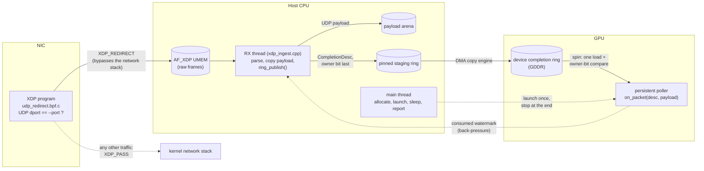

# GPU NIC-CQ Polling (GNP)

Kernel-bypass UDP receive with completion-queue polling moved off the CPU and
onto GPU SMs.

There are two receive paths, and they differ in how far the CPU is removed
from the data plane.

**`gnp_gpunetio` - GPU-direct (DOCA GPUNetIO / GDAKI).** The NIC's own hardware
steering sends one UDP port straight into a buffer in GPU memory, and a
persistent CUDA kernel reads those frames there. No kernel network stack, no
userspace copy, no CPU thread on the data path at all. `gnp::on_packet()` gets
real packet bytes. Needs a ConnectX-6 Dx or newer (or BlueField-2/3), so it is
**built and compile-verified but not yet run** - see
[`docs/README.md`](docs/README.md#status).

**`gnp` - AF_XDP + completion ring.** An eBPF/XDP program redirects one UDP
port into a userspace socket before the kernel network stack sees the frame. An
RX thread copies each payload into a host arena and publishes a 32-byte
`CompletionDesc` into a ring that is DMA'd to GPU memory, where a persistent
CUDA kernel polls it. The CPU still parses and copies, and the kernel sees only
descriptors - never packet bytes. This path runs on ordinary NICs and is the
one with measured results.

| document | contents |
|---|---|
| **this file** | what the two paths are, how to build them, how to run on a NIC |
| [`testing/README.md`](testing/README.md) | unit tests, the simulated NIC, pcap replay, benchmarks |
| [`docs/README.md`](docs/README.md) | measured results and an index of the design docs |
| [`docs/design.md`](docs/design.md) | the protocol and the reasoning behind every design choice |



## How a packet gets through

1. **Attach.** `gnp` loads `udp_redirect.bpf.o`, writes `--port` and
   `--nic-queue` into its `config_map`, and attaches it to `--iface`. It uses
   native (driver) XDP when the NIC supports it and generic (SKB) XDP otherwise.
2. **Open the socket.** One AF_XDP socket is bound to NIC RX queue
   `--nic-queue` (default 0) and registered in the program's `xsks_map`. A 16 MiB
   UMEM (4096 × 4 KiB frames) is handed to the kernel through the fill ring.
3. **Filter at the driver.** For every incoming frame, the XDP program checks
   Ethernet → IPv4 → UDP with bounds checks. An unfragmented datagram to the
   capture port is redirected into the socket. Anything else (other ports, TCP,
   ARP, IPv6, fragments) gets `XDP_PASS` and reaches the normal stack, so SSH
   and everything else on the interface keep working.
4. **Ingest.** The RX thread (`gnp-xdp-rx`) takes up to 64 descriptors from
   the RX ring at a time. For each frame it re-validates the headers, copies the
   UDP payload into arena slot `ring_slot(idx) × --size`, and calls
   `ring_publish()`. That fills `payload_offset`, `byte_len`, `packet_id` and
   `post_ns`, issues a full fence, and writes the owner bit last. The UMEM frame
   goes straight back on the fill ring.
5. **Move to the GPU.** After each batch, the new descriptors are DMA'd from
   pinned staging into the device ring, owner bit last per slot.
6. **Poll.** The persistent kernel spins on one load plus an owner-bit compare.
   When a descriptor is ready it reads the fields, calls
   `on_packet(desc, payload)`, updates the counters, and publishes its consumed
   watermark every 64 packets so the RX thread knows which slots are free.
7. **Stop and report.** After `--duration`, the RX thread is joined, the XDP
   program is detached, and the socket is closed. The XDP program's and the
   kernel's counters are printed. The poller drains up to the final published
   count before it retires, then the summary is printed.

## Build

### 1. Install the dependencies

| dependency | needed for | Fedora | Debian / Ubuntu |
|---|---|---|---|
| CMake ≥ 3.24, g++ (C++17), pkg-config | everything | `cmake gcc-c++ pkgconf` | `cmake g++ pkg-config` |
| libbpf, libxdp, kernel headers | AF_XDP ingest | `libbpf-devel libxdp-devel kernel-headers` | `libbpf-dev libxdp-dev linux-libc-dev` |
| clang, llvm | compiling the XDP program | `clang llvm` | `clang llvm` |
| CUDA toolkit | GPU poller (optional) | see [below](#installing-cuda-fedora) | `nvidia-cuda-toolkit` |

```bash
sudo dnf install cmake gcc-c++ pkgconf clang llvm libbpf-devel libxdp-devel kernel-headers
```

**CUDA is required**: every receive path polls from an SM, so configure fails
without a working `nvcc`. Without libbpf, libxdp or clang, `gnp` still builds
but has no packet source and says so at startup. The GPU-direct path needs the
DOCA SDK as well; see [Building the GPU-direct path](#building-the-gpu-direct-path).

### 2. Configure and build

```bash
cmake --preset prod
cmake --build --preset prod
```

The configure log states what was found. Check this line:

```
-- gnp: AF_XDP ingest enabled (libbpf 1.6.3, libxdp 1.6.3, /usr/bin/clang)
-- gnp: cuda=ON xdp=ON testing=OFF
```

- `xdp=ON`: the AF_XDP ingest is compiled in. With `OFF`, the warning above it
  names what's missing.
- `gpunetio=ON`: the GPU-direct path is compiled in. It is `OFF` unless the
  DOCA SDK is present, which on most machines means building in the container.
- `testing=OFF`: nothing from `testing/` is compiled or linked.

The output is two files:

```
build/prod/gnp                 the receiver
build/prod/udp_redirect.bpf.o  the XDP program, loaded by gnp at startup
```

Keep them together, or pass `--bpf-obj PATH`.

### 3. Presets

| preset | builds | use it for |
|---|---|---|
| `prod` | `gnp` | real traffic on the AF_XDP path |
| `dev` | `gnp`, `gnp_sim`, `test_ring` | development, benchmarks, CI ([testing/README.md](testing/README.md)) |
| `debug` | same as `dev`, `-O0 -g` | debugging |
| `gpunetio` | `gnp_gpunetio` | the GPU-direct path; run it through `scripts/doca-build.sh` |

The underlying options are `GNP_ENABLE_XDP` (ON), `GNP_ENABLE_GPUNETIO` (ON)
and `GNP_BUILD_TESTING` (OFF). The first two auto-detect, and turning one OFF
skips the detection.

### Building the GPU-direct path

DOCA ships for Ubuntu, RHEL/Rocky, Debian, SLES, Oracle, Azure and Amazon Linux
- not Fedora - so the build runs inside NVIDIA's DOCA container, which already
carries DOCA 3.5 and CUDA 13:

```bash
scripts/doca-build.sh          # configure + build -> build/gpunetio/gnp_gpunetio
scripts/doca-build.sh --shell  # a shell in the same environment
```

The container exists to compile and link against genuine DOCA headers. Running
the result needs a ConnectX NIC, which the container cannot conjure; without
one the binary exits with `no DOCA device at PCI ...`.

### Installing CUDA (Fedora)

Only the NVIDIA driver is required at runtime, but `nvcc` is needed to build the
kernel:

```bash
sudo dnf install cuda-toolkit
```

Two things commonly bite on a current Fedora:

- **Host compiler too new.** `nvcc` rejects host compilers it does not
  recognise, and Fedora's GCC runs ahead of every CUDA release.
  `cmake/gnp_cuda.cmake` handles this automatically:
  - It finds `nvcc` on `PATH`, via `CUDACXX`/`CUDA_PATH`, or in `/usr/local/cuda`.
  - It probes it with the default `g++`, then every installed versioned `g++-N`
    from newest to oldest, and keeps the first pairing `nvcc` accepts.
  - The configure log shows each probe (`gnp: probing ...`).

  If none is accepted, install a supported one (e.g. `sudo dnf install gcc14-c++`)
  or pass `-DCMAKE_CUDA_HOST_COMPILER=/usr/bin/g++-14`. An explicit choice is the
  only one tried. A failed probe is re-run on the next configure rather than
  cached, so you never need to delete a build directory after fixing the toolchain.
- **Display-GPU watchdog.** If the GPU also drives your desktop, a persistent
  kernel will freeze the display for as long as it runs and may be killed by the
  X/Wayland watchdog after a few seconds. Keep `--duration` short, or run on a
  GPU that is not driving a display.

## Run on a NIC

### Pick the hardware

The NIC's driver decides whether this is real kernel bypass:

- **Native XDP** runs in the driver before any skb is allocated. Supported by
  Intel `ice`, `i40e`, `ixgbe`, `igb`, `igc`, Mellanox `mlx5`, `virtio_net` and
  others. `ice`, `i40e` and `mlx5` also support zero-copy AF_XDP.
- **Generic XDP** works on any interface (Wi-Fi, USB Ethernet, veth), but runs
  after skb allocation. It is correct but not a bypass.

Check the driver with `ethtool -i <iface>`. The GPU should be in the same
machine as the NIC.

### Prepare the interface

```bash
# multi-queue NICs spread flows over RX queues; put the capture port on queue 0
sudo ethtool -N enp1s0 flow-type udp4 dst-port 9000 action 0
# or collapse to a single queue
sudo ethtool -L enp1s0 combined 1
```

AF_XDP only sees packets on the queue its socket is bound to. Matching packets
that arrive on another queue are passed to the kernel, not dropped, but `gnp`
won't see them. The exit report says when this happens.

### Start the receiver

```bash
sudo ./build/prod/gnp --iface enp1s0 --port 9000 --duration 30000
```

| flag | meaning | default |
|---|---|---|
| `--iface NAME` | interface to attach the XDP program to | required |
| `--port N` | destination UDP port to capture | required |
| `--nic-queue N` | NIC RX queue the AF_XDP socket binds to | 0 |
| `--skb-mode` | force generic XDP | native, falling back to generic |
| `--bpf-obj PATH` | XDP program object | `udp_redirect.bpf.o` next to `gnp` |
| `--ring N` | entries in the completion ring, power of two | 1024 |
| `--size B` | arena bytes per slot = largest UDP payload kept | 1024 |
| `--duration MS` | how long to capture | 2000 |
| `--backoff NS` | relax the poll loop when idle, `0` = pure spin | 0 |
| `--copy-timing` | time 1 in 32 H2D flushes (CUDA) | off |
| `--verbose` | device and allocation details | off |

- **Privileges.** Loading XDP and opening AF_XDP sockets needs root. Instead of
  `sudo` you can grant capabilities once:
  `sudo setcap cap_net_admin,cap_net_raw,cap_bpf,cap_perfmon,cap_ipc_lock+ep build/prod/gnp`.
  `CAP_IPC_LOCK` is needed because the UMEM is locked memory.
- **Native first.** Without `--skb-mode`, `gnp` tries native XDP and prints
  `falling back to generic (SKB) mode` if the driver can't do it.
- **One XDP program per interface.** `gnp` refuses to replace an existing one.
  Check with `ip link show enp1s0` (look for `prog/xdp`). If a killed run left
  the program attached, remove it with `sudo ip link set enp1s0 xdp off` (or
  `xdpgeneric off`).
- **v1 scope.** One UDP port, one RX queue, IPv4, `--queues 1`.

Send traffic from another machine while it runs. To replay a capture with
tcpreplay, see
[testing/README.md](testing/README.md#4-real-nic-tcpreplay-from-a-second-machine).

### Read the result

`gnp` prints two diagnostic lines before the summary:

```
[gnp] AF_XDP kernel counters: rx_dropped=0 rx_invalid=0 rx_ring_full=0 fill_ring_empty=0
[gnp] XDP program: 10000 frames to UDP port 9000, 10000 of them on RX queue 0
```

| symptom | meaning |
|---|---|
| `XDP program: 0 frames` | no traffic reached the interface while `gnp` was attached (wrong port, wrong IP/MAC, or sent outside the window) |
| frames on queue 0 < frames total | RSS put some on other queues; steer the port (above) |
| `rx_ring_full` or `fill_ring_empty` > 0 | the RX thread fell behind and the kernel dropped frames |
| `frames dropped` > 0 in the summary | a payload was larger than `--size`, or a frame was malformed |
| `ring-full stalls` > 0 | the poller fell behind and the RX thread waited for free slots |

A clean run has `descriptors published` == `packets observed` == frames on the
bound queue, `packet-id gaps` == 0, and every counter above at zero. The other
summary fields are explained in
[docs/README.md](docs/README.md#reading-the-run-summary).

## Where packet processing goes

[`include/gnp/packet_handler.hpp`](include/gnp/packet_handler.hpp):

```cpp
struct PacketView {
    const uint8_t* data;  // nullptr when the poller cannot reach the bytes
    uint32_t       len;
};

GNP_HD GNP_FORCEINLINE void on_packet(const PacketView& pkt) {
    (void)pkt;
}
```

Both paths call it once per packet, right after the packet is observed. What
`data` points at is the difference between them:

- **GPU-direct path:** the full Ethernet frame, in GPU memory, put there by the
  NIC. This is the only path where the hook can do real work.
- **AF_XDP path:** always `nullptr`. That path stages UDP payloads in a host
  arena and DMAs only descriptors to the device, so the kernel knows a packet
  arrived and how long it was, but cannot read it.

It runs on the poll loop's critical path, so whatever you put there sets the
per-packet budget. Slow work should be handed off (for example, to the rest
of the warp on the GPU) rather than done inline.

## Layout

```
include/gnp/            shared by both paths unless noted
  common.hpp          RunConfig, clocks, GNP_HD, GNP_FORCEINLINE, GNP_CUDA_CHECK
  packet_handler.hpp  PacketView and on_packet(): the processing hook (empty)
  cli.hpp             flag parsing, scoped per path
  metrics.hpp         PollStats, report()
  ring.hpp            AF_XDP path: CompletionDesc / CompletionRing /
                      RingControl, owner-bit math, IngestStats, ring_publish()
  xdp_ingest.hpp      AF_XDP path: ingest lifecycle
  gpu_poll.hpp        AF_XDP path: ring backend, PollQueue, Session
  gpunetio.hpp        GPU-direct path: session lifecycle
src/host/             the AF_XDP path plus the shared core
  main.cpp            gnp: attach, poll, capture, report
  xdp_ingest.cpp      BPF load/attach, UMEM and socket, RX thread
  ring.cpp            ring_publish(): the owner-bit publish protocol
  setup.cpp           allocation, teardown, poller retire, host_now_ns()
  cli.cpp             shared flag table
  metrics.cpp         aggregation and end-of-run summary
src/gpu/
  poll_kernel.cu      the persistent ring pollers (<<<queues, 1>>>)
  utils.cu            device probe, shared allocation, copy streams, H2D flush
src/bpf/
  udp_redirect.bpf.c  XDP program: one UDP port -> AF_XDP socket, rest XDP_PASS
src/gpunetio/         the GPU-direct path; nothing below on_packet() is shared
  main_gpunetio.cpp   gnp_gpunetio: start, sleep, report
  setup.cpp           DOCA device, VRAM packet buffer, rxq on GPU, flow steering
  receive_kernel.cu   the persistent receive loop (one block per queue)
cmake/
  gnp_cuda.cmake      finds a working nvcc + host compiler pair (required)
  gnp_xdp.cmake       finds libbpf, libxdp and clang
  gnp_doca.cmake      finds the DOCA SDK
scripts/
  doca-build.sh       build the GPU-direct path in NVIDIA's DOCA container
testing/              simulator, unit tests, scripts; see testing/README.md
docs/                 results and design; see docs/README.md
```
